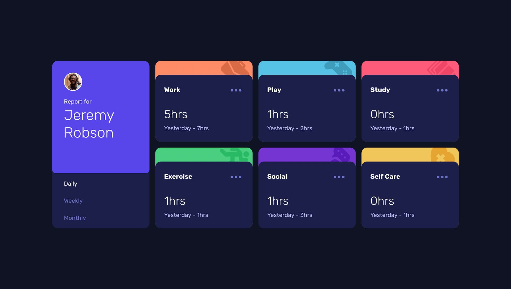

# Frontend Mentor - Time tracking dashboard solution

This is a solution to the [Time tracking dashboard challenge on Frontend Mentor](https://www.frontendmentor.io/challenges/time-tracking-dashboard-UIQ7167Jw). Frontend Mentor challenges help you improve your coding skills by building realistic projects.

## Table of contents

- [Overview](#overview)
  - [The challenge](#the-challenge)
  - [Screenshot](#screenshot)
  - [Links](#links)
- [My process](#my-process)
  - [Built with](#built-with)
  - [What I learned](#what-i-learned)
  - [Continued development](#continued-development)
  - [Useful resources](#useful-resources)
- [Author](#author)
- [Acknowledgments](#acknowledgments)

## Overview

### The challenge

Users should be able to:

- View the optimal layout for the site depending on their device's screen size
- See hover states for all interactive elements on the page
- Switch between viewing Daily, Weekly, and Monthly stats

### Screenshot

### Links

- Solution URL: [Add solution URL here](https://your-solution-url.com)
- Live Site URL: [Add live site URL here](https://your-live-site-url.com)

## My process

### Built with

- Semantic HTML5 markup
- SCSS
- Flexbox
- CSS Grid
- Mobile-first workflow
- Vite
- Fetch API

### What I learned

- the `data.json` and `main.js` file needs to be in the /public folder. Vite will serve everthing from the public folder at the root of the site.

_**Fetch API**_

_**Tabs pattern**_  
That's my first time doing a tabs interface from sratch. There are some things to consider to make the tabs accessible and navigable by keyboard. Tabs interface require JavaScript to handle these interactions.  
The different elements are :

- Tabs  
  A set of tab elements and their associated panels.
- Tab List  
  A set of tab elements contained in a tablist element.
- tab  
  An element in the tab list that serves as a label for one of the panel and can be activated to display that panel.
- tabpanel  
  The element that contains the content associated with a tab

Keyboard only users need to be able to use a tabs interface.

- Switch between tabs using arrow key
- Move to a panel content using the tab key
- Navigating on the tab isn't made with tab key like in a usual navigation list but using the arrow keys
- if the tablist is vertical the user can use up and down key to switch between the tabs and the corresponding panel can be automatically displayed when the tab is in focus. _this is called tabs with automatic activation_. Manual activation is slightly different and will require an action from the user to activate the corresponding panel.
- if the tablist is horizontal the user can use the left and right key to navigate between the tabs. The up and down key are used for scrolling.

There are a list of role and aria required by the tabs interface.

- `role="tabslist"` for the container of tabs
- `role="tab"` for each of the tab
- `role="tabpanel"` for each of the tab pannel
- `aria-controls="tab-id"` to each element with the `tab` role. It refers to the corresponding panel.
- The activated tab element has the state `aria-selected` set to true. All others have it set to false.
- Each element with the role `tabpanel` has the property `aria-labelledby="tab-id"` refering to the associated tab element.
- if the `tablist` element is vertically oriented it has property `aria-orientation` set to vertical.

It can be interesting to take progressive enhancement in consideration and add these roles with JavaScript. Here I'm fetching the date for the tab pannels, without JavaScript the panels are empty.

### Continued development

It would be nice to add a menu on the activity card with some options like "edit, delete"

### Useful resources

- [Tabs pattern - ARIA Authoring Practice Guide](https://www.w3.org/WAI/ARIA/apg/patterns/tabs/)
- [MatchMeddia - MDN](https://developer.mozilla.org/en-US/docs/Web/API/Window/matchMedia)
- [Creating Accessible Tabs with HTML, CSS and JS - Keving Powell](https://www.youtube.com/watch?v=fI9VM5zzpu8)
- [Fetch API - MDN](https://developer.mozilla.org/fr/docs/Web/API/fetch)
- [async function - MDN](https://developer.mozilla.org/en-US/docs/Web/JavaScript/Reference/Statements/async_function)

## Author

- Website - [Gwenaël Magnenat](https://gmagnenat.com)
- Frontend Mentor - [@gmagnenat](https://www.frontendmentor.io/profile/gmagnenat)
- LinkedIn - [@gmagnenat](https://www.linkedin.com/ingmagnenat)
